<div align="center">



[Website](https://yushunchen.com) · [Projects](https://github.com/YushunChen?tab=repositories) · [GitHub](https://github.com/YushunChen)

</div>

### Hello, world 👋

I'm Oliver, a software engineer who enjoys turning ambiguous problems into dependable, useful products. Lately, I have been exploring agentic systems, personal-finance automation, and the details that make software trustworthy.

```text
current_location  = Durham, NC
day_job           = Software Engineer @ Dell Technologies
education         = M.S. ECE @ Duke · CS + Statistics + Math @ UW–Madison
currently_building= AI agents · automation · full-stack tools
```

### Selected builds

| Project | What it does | Built with |
| :-- | :-- | :-- |
| [yushunchen.com](https://github.com/YushunChen/yushunchen.github.io) | My corner of the internet | JavaScript · Web |
| [RISC](https://github.com/YushunChen/risc-game) | Multiplayer strategy game for up to four players | Java · JavaScript |
| [Mini Amazon](https://github.com/YushunChen/mini-amazon) | Scalable marketplace with buyers, sellers, orders, and inventory | Django · PostgreSQL |
| [AAlarm](https://github.com/YushunChen/AAlarm) | Android app designed to fight procrastination and forgetfulness | Java · Android |

### How I think about building

> Make it useful. Make it understandable. Then make it fast.

I care about clear interfaces, observable behavior, thoughtful automation, and systems that fail gracefully. If you are working on something in that neighborhood, say hello.

<div align="center">

<sub>Thanks for stopping by — this profile is self-contained, so what you see today should still render tomorrow.</sub>

</div>
